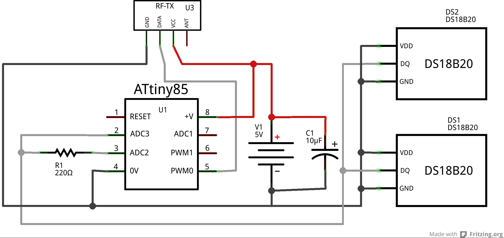
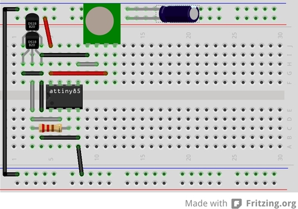

CosaWirelessDS18B20
===================
Demonstration sending temperature readings from two 1-Wire [DS18B20](http://datasheets.maximintegrated.com/en/ds/DS18B20.pdf)
devices over the Wireless Interface and devices. Uses power down mode
with only watchdog active (5-6 uA on ATtiny85-20PU). This sketch is
designed to run on an ATtiny85 running on the internal 8 MHz clock with
parasite powering of the 1-wire bus. 

Circuit
-------

### Diagram

### Breadboard

